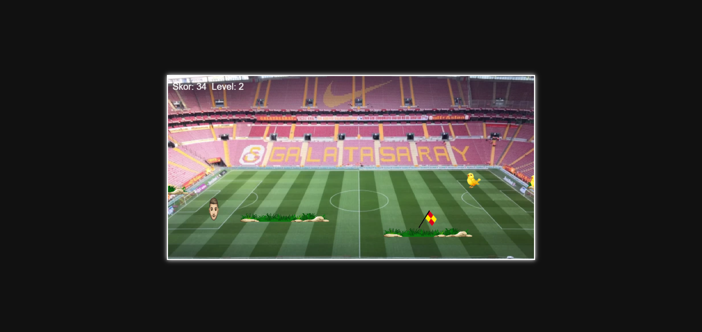
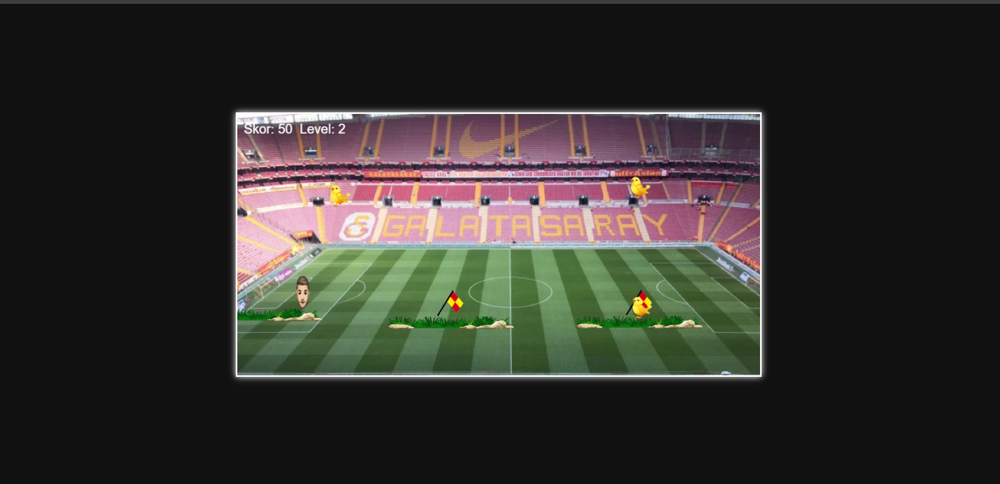

# Javascript-Oyun

# OYUN HAKKINDA
<h4>Oyuncu, yeşil platformlar üzerinde özgürce zıplayabilir ve skor toplamak için futbol toplarını toplamaya çalışır. Her toplanan top oyuncuya +10 puan kazandırır. Skor 200 puana ulaştığında, sahneye bir kupa yerleştirilir. Kupaya ulaşan oyuncu bir üst seviyeye geçer.

Oyun iki seviyeden oluşur. İlk seviyede engeller nispeten basitken, ikinci seviyede zorluk artar. Gökyüzünde dolaşan kanaryalar sahneye çıkar ve onlara çarpmak oyunun bitmesine neden olur. Aynı şekilde, platformlara yerleştirilmiş ofsayt bayrakları (tuzaklar) da oyuncuya temas ettiğinde oyunu sonlandırır.

Oyuncunun görevi; engellerden kaçmak, skor toplamak, dikkatli bir şekilde platformlar arasında zıplamak ve kupaya ulaşarak bir üst seviyeye geçmektir.</h4>

# OYUN FOTOSU

# OYUNU Açmak için

Oyununa ulaşmak için tek yapmanız gereken `src/` klosöründeki index.html dosyasını güncel bir web tarayıcınız ile açmanız yeterli.
